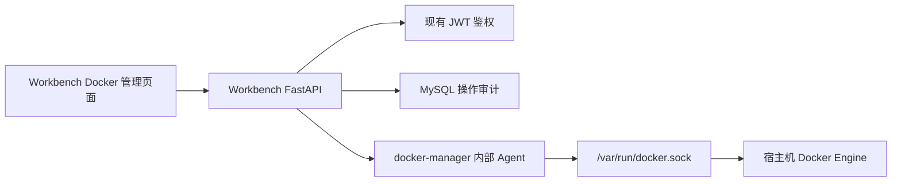

# Docker 服务集中管理设计

## 目标

在现有 Workbench 中增加单服务器 Docker 管理能力，集中查看服务器上的全部 Docker 容器和 Compose 服务，并支持容器生命周期操作、服务级批量操作、实时日志和操作审计。

当前范围是：一台服务器、一个管理员账号、完整容器控制能力。设计需要兼容现有 Vue 3 + FastAPI + MySQL + Docker Compose 部署，不影响现有工作台功能。

## 已确认的决策

- 采用独立 `docker-manager` Agent，不让现有 Workbench API 直接挂载 Docker Socket。
- `docker-manager` 是唯一挂载 `/var/run/docker.sock` 的容器。
- 浏览器只访问现有 FastAPI，不能直接访问 Docker Socket 或 Agent。
- 首期支持容器状态、服务状态、日志、启动、停止、重启、暂停、恢复、强制终止和删除。
- 当前只服务一个管理员账号，但保留现有登录鉴权和审计边界。
- 不提供任意宿主机 Shell 或任意 `docker exec`。
- Docker 状态实时读取，不持久化容器清单；Docker 日志实时读取，不保存到 MySQL。

## 架构



### Workbench 前端

新增 Docker 管理入口和 `/docker` 路由。前端只调用现有 API，不感知 Docker Socket、Agent Token 或宿主机地址。

### Workbench FastAPI

FastAPI 负责：

- 使用现有 JWT 校验当前用户。
- 校验目标容器、服务和动作参数。
- 对危险操作执行二次确认要求。
- 转发 Agent 的查询和动作请求。
- 将 Agent 的日志流转发给浏览器。
- 写入操作审计。
- 将 Docker 错误转换为稳定的中文业务错误。

### docker-manager Agent

Agent 是独立的内部服务，使用 Docker SDK 调用宿主机 Docker Engine。它只负责 Docker 资源发现、状态映射、日志读取和动作执行，不理解 Workbench 用户和业务权限。

Agent 只加入 `workbench-internal` 网络，不发布宿主机端口。它通过共享 Token 接受 Workbench API 的内部请求，并使用请求 ID 保持调用链可追踪。

### Docker 对象分层

- Compose 项目：根据 `com.docker.compose.project` 标签分组。
- Compose 服务：根据 `com.docker.compose.service` 标签分组。
- 容器：展示所有 Docker 容器，包括非 Compose 容器。

服务级启动、停止和重启通过同一 Compose 服务下的容器集合执行；每个容器的结果单独返回。

## 前端设计

### 总览页

路由：`/docker`。

顶部显示 Docker Engine 在线状态、容器总数、运行中数量、停止数量、异常数量、Compose 项目数量和资源使用概览。

主体支持两个视图：

- 服务视图：按 Compose 项目和服务分组。
- 容器视图：平铺全部容器，包括非 Compose 容器。

列表字段包括名称、所属项目和服务、状态、Health Check、镜像、运行时长、端口、CPU、内存和更新时间。支持按名称、项目、状态和健康状态筛选，并自动轮询刷新。

### 容器详情

详情页或侧边抽屉显示基本信息、状态、健康检查、镜像、命令、启动时间、端口、网络、挂载卷、CPU、内存、重启次数和最近事件。

环境变量默认只显示名称和配置摘要，敏感值不直接展示。

容器操作为：

```text
start, stop, restart, pause, unpause, kill, remove
```

删除和强制终止要求二次确认并输入容器名。受保护容器禁止从界面删除。

### 日志面板

支持 stdout/stderr 区分、最近 N 行、时间范围、关键词搜索、自动滚动、实时跟随、暂停跟随和下载当前日志。日志通过 SSE 实时转发，不写入数据库。

### 服务级操作

服务分组支持启动、停止和重启。确认前显示受影响的容器列表；执行后逐项展示成功或失败结果。

## API 设计

浏览器访问的 FastAPI 路由：

```text
GET    /api/docker/overview
GET    /api/docker/projects
GET    /api/docker/containers
GET    /api/docker/containers/{id}
GET    /api/docker/containers/{id}/logs
GET    /api/docker/containers/{id}/logs/stream
POST   /api/docker/containers/{id}/actions/{action}
POST   /api/docker/services/{project}/{service}/actions/{action}
GET    /api/docker/audit-logs
```

Agent 内部路由：

```text
GET  /internal/v1/overview
GET  /internal/v1/projects
GET  /internal/v1/containers
GET  /internal/v1/containers/{id}
GET  /internal/v1/containers/{id}/logs
POST /internal/v1/containers/{id}/actions/{action}
POST /internal/v1/services/{project}/{service}/actions/{action}
```

约束：

- 浏览器不能获得 Agent Token。
- FastAPI 对所有 Docker 路由执行现有 JWT 鉴权。
- Agent 请求携带 Token 和 request ID。
- 日志流使用 `text/event-stream`，断开时释放 Docker 日志流和 HTTP 连接。
- 每次动作返回最终状态或明确的超时/失败结果，不把请求发出等同于执行成功。

## 审计数据

新增 `docker_operation_log` 表，字段包括：

- `id`
- `user_id`
- `target_type`
- `target_id`
- `target_name`
- `action`
- `request_summary`
- `result`
- `error_message`
- `duration_ms`
- `created_at`

容器清单和日志不写入该表，只记录控制操作及结果摘要。请求摘要不得保存完整环境变量、Token 或日志正文。

## 部署与安全

在现有 `docker-compose.yml` 增加 `docker-manager` 服务：

- 挂载 `/var/run/docker.sock`。
- 只加入 `workbench-internal` 网络。
- 不发布宿主机端口。
- 不设置 `privileged: true`。
- 启用只读根文件系统、禁止新增 Linux 权限、限制 CPU 和内存。
- 配置 Agent 健康检查。
- 通过环境变量注入共享 Token。

Workbench API 使用以下配置：

```env
DOCKER_MANAGER_URL=http://docker-manager:9100
DOCKER_MANAGER_TOKEN=随机长字符串
DOCKER_PROTECTED_CONTAINERS=workbench-api,workbench-web,docker-manager,xp-mysql
```

受保护容器可查看、读取日志、启动、停止和重启，但不可从界面删除。保护列表使用环境变量配置，避免把容器名称硬编码到业务逻辑中。

安全策略：

- Docker 管理 API 必须登录。
- Agent 只接受内部网络请求和正确 Token。
- 写操作采用动作白名单。
- 删除和强制终止需要二次确认。
- 删除要求输入容器名。
- 日志默认限制返回行数和单次大小。
- 环境变量敏感值默认隐藏。
- 所有写操作写入审计表。
- 不提供任意宿主机命令和任意 `docker exec`。

## 错误处理

- Docker Engine 不可用：返回管理服务异常，不伪造缓存状态。
- 容器不存在：返回容器可能已被外部删除，并要求刷新列表。
- 批量操作部分失败：逐项返回成功和失败结果。
- 操作超时：记录超时并提示刷新确认最终状态。
- 启动已运行容器、停止已停止容器等幂等动作按最终状态返回成功。
- Agent 重启期间，前端显示管理服务暂不可用，现有工作台业务继续可用。

## 测试与验证

### Agent 单元测试

- Docker SDK 调用和状态映射。
- Compose 项目/服务标签分组。
- 日志参数和大小限制。
- 动作白名单。
- Docker 异常到稳定错误的转换。

### FastAPI 测试

- JWT 鉴权。
- Agent Token 和请求转发。
- 受保护容器删除拦截。
- 危险动作确认。
- 审计日志写入。
- 批量操作的部分失败处理。

### 前端测试

- Docker 导航和路由。
- 状态卡片和容器列表。
- 项目/状态/健康筛选。
- 日志读取和 SSE 断开。
- 危险动作二次确认。
- 操作失败和部分失败提示。

### Docker 集成验证

使用测试容器验证发现、日志、启动、停止、重启和删除；同时确认现有 Workbench API、Web、MySQL 容器和网络不被破坏。

## 上线与回滚

上线顺序：

1. 构建并启动 `docker-manager`。
2. 验证 Agent 健康检查和内部 Token 调用。
3. 部署更新后的 Workbench API。
4. 验证 Docker 总览、日志流和基础生命周期操作。
5. 发布前端并完成浏览器端回归。

回滚时停止或移除 `docker-manager` 和 Docker 管理 API 代码路径，不删除任何容器、网络、Volume 或现有业务数据；原有 Workbench 服务继续按此前 Compose 配置运行。

## 非目标

- 不管理多台服务器。
- 不提供宿主机 Shell。
- 不提供任意 `docker exec`。
- 不把 Docker 日志作为长期日志平台。
- 不在首期执行镜像构建、Compose 文件编辑或任意 `docker compose up --build`。

## 验收标准

完成后，管理员可以在工作台中：

1. 看到服务器上全部容器及 Compose 服务分组。
2. 看到容器运行、停止、异常和健康检查状态。
3. 查看指定容器的实时日志并停止日志跟随。
4. 对容器执行启动、停止、重启、暂停、恢复、强制终止和删除。
5. 对 Compose 服务执行启动、停止和重启，并看到逐容器结果。
6. 查看每次写操作的审计记录。
7. 在 Docker Engine 或 Agent 异常时看到准确错误，且不影响现有工作台功能。
